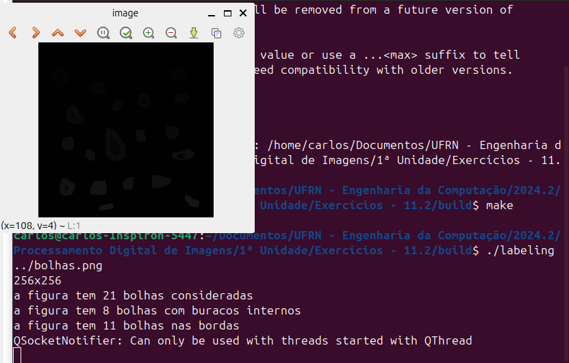

= Processamento Digital de Imagens (2024.2)
Carlos Antonio Miranda Filho <carlosantonio_miranda@hotmail.com>

== Cap 11 - Preenchendo regiões

Este capítulo trata de rotular os objetos presentes numa imagem através de uma técnica chamada *floodfill*. Originalmente a gravura estudada é esta:

image::bolhas.png[]

Um código inicialmente feito trata de percorrer a imagem pixel por pixel para localizar as bolhas. Temos duas cores, 0 para o caso da cor preta e 255 da cor branca. Caso ao percorrer o algoritmo encontre o valor 255, dizemos que o objeto foi achado e o contador é preenchido com uma floodfill do OpenCV. Este, por sua vez, faz o processo pegando o ponto semente e procura seus 4 ou 8 vizinhos próximos desse ponto.

Originalmente o código encontra-se abaixo:

----
#include <iostream>
#include <opencv2/opencv.hpp>

int main (int argc, char** argv) {
    cv::Mat image, realce;
    int width, height;
    int nobjects;

    //Vou rotular uma imagem através do algoritmo floodfill para
    //descobrir os aglomerados de pixels

    /*Vou assumir que os pixels são binários e que cada um é um objeto indidividual */
    cv::Point p; //defino um ponto em 2ª dimensão que acessa as coord. x e y
    image = cv::imread(argv[1], cv::IMREAD_GRAYSCALE); //converto a imagem em tons de cinza

    if(!image.data) {
        std::cout << "Imagem não pode ser carregada\n";
        return (-1);
    }

    width = image.cols;
    height = image.rows;
    std::cout << width << "x" << height << std::endl;

    p.x = 0;
    p.y = 0;

    //o floodfill pega o ponto semente e procura seus 4 ou 8 vizinhos desse ponto
    //busca objetos presentes
    nobjects = 0;
    for (int i=0; i<height; i++) {
        for (int j=0; j<width; j++) {
            if (image.at<uchar>(i,j) == 255) {
                //quando o valor for igual a 255, dizemos que o objeto foi achado
                nobjects++;
                //p/ o floodfill, as coordenadas são trocadas
                p.x = j;
                p.y = i;
                //preenche o objeto com contador
                cv::floodFill(image, p, nobjects);
            }
        }
    }

    std::cout << "a figura tem " << nobjects << " bolhas\n";
    cv::imshow("image", image);
    cv::imwrite("labeling.png", image);
    cv::waitKey();
    return 0;
}
----

Fazendo a compilação do código, o algoritmo conta 32 bolhas.

=== Exercícios 10.2

O código mostrado antes foi programado para fazer a localização das bolhas em um intervalo [0, 255] (i.e., 256 ao todo). Caso exista valores maiores que 255, não será possível com aquelas configurações fazer a identificação e rotulação dos objetos porque dentro do laço é utilizado um tipo _uchar_ (unsigned char), que suporta apenas os valores desse intervalo em 8 bits. Caso o floodfill fosse utilizado para rotular mais que 255 objetos, seria necessário usar outro tipo como _ushort_, que armazena valores maiores por ser de 16 bits.

Após o teste inicial do código, este será modificado para fazer a detecção de bolhas que se encontram na borda, que possuem buracos internos e por fim as bolhas que seriam consideradas (neste caso, as bolhas que tocam a borda serão excluídas). O código para a proposta da questão encontra-se abaixo:

----
#include <iostream>
#include <opencv2/opencv.hpp>

int main(int argc, char** argv) {
    cv::Mat image, realce, labels;
    int width, height;
    int nobjects, nburacos, nbordas;

    cv::Point p; //defino um ponto em 2ª dimensão que acessa as coord. x e y
    image = cv::imread(argv[1], cv::IMREAD_GRAYSCALE); //converto a imagem em tons de cinza

    if(!image.data) {
        std::cout << "Imagem não pode ser carregada\n";
        return (-1);
    }

    width = image.cols;
    height = image.rows;
    std::cout << width << "x" << height << std::endl;

    p.x = 0;
    p.y = 0;

    nobjects = 0;
    nburacos = 0;
    nbordas = 0;
    for (int i=0; i<height; i++) {
        for (int j=0; j<width; j++) {
            if (i==0 || j == 0 || i == height-1 || j== width-1) { //fazendo a detecção das bolhas nas bordas
                if(image.at<uchar>(i,j) == 255) {
                nbordas++;  //registro em nbordas e abaixo elimino as bolhas
                p.x = j;
                p.y = i;
                cv::floodFill(image, p, 0);
                }
            }
        }
    }

    //Fazendo a busca pelas bolhas, dentro dele também vou verificar as bolhas com buracos
    for (int i=0; i<height; i++) {
        for (int j=0; j<width; j++) {
            if (image.at<uchar>(i,j) == 255) {
                nobjects++;
                p.x = j;
                p.y = i;
                cv::floodFill(image, p, nobjects);
            }

            if (image.at<uchar>(i,j) == 0) {
                nburacos++;
                p.x = j;
                p.y = i;
                cv::floodFill(image, p, nburacos);
            }
        }
    }

    std::cout << "a figura tem " << nobjects << " bolhas consideradas\n";
    std::cout << "a figura tem " << nburacos << " bolhas com buracos internos\n";
    std::cout << "a figura tem " << nbordas << " bolhas nas bordas\n";
    cv::imshow("image", image);
    cv::imwrite("labeling.png", image);
    cv::waitKey();
    return 0;
}
----

O primeiro laço for é voltado para a verificação das bolhas que se encontram nas bordas, que se dará primeiro percorrendo no instante em que i ou j forem iguais a zero ou quando a largura ou altura estiverem para terminar de percorrer. Dentro dessas condições, caso o valor da imagem seja diferente do fundo preto (que é 0), então a bolha se encontra na borda, cujo valor será contado na variável nbordas. Em seguida, o floodfill é usado para descartar a bolha detectada.

O segundo laço for faz a verificação das bolhas com buracos internos e das bolhas nos casos que se encontram espalhadas na imagem. O processo aqui se dá de forma similar ao visto no primeiro for, com a diferença que eles vão passar pela imagem toda e se o valor no <uchar> for igual a 255, então uma bolha foi detectada, fazendo parte da contagem _nobjects_. Um segundo if serve para verificar se nas bolhas existem buracos, com o funcionamento similar, porém utilizando uma variável _nburacos_ para armazenar os casos.

O resultado com a visualização das bolhas e dos valores encontrados encontra-se abaixo:

