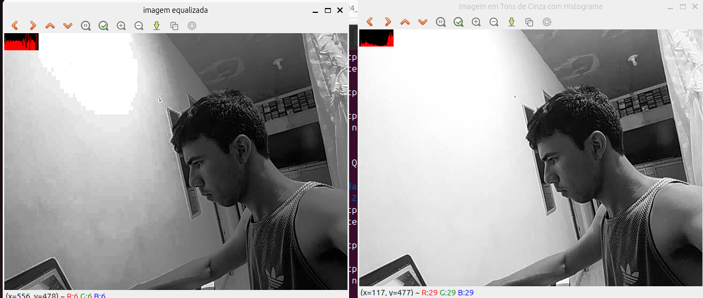

= Processamento Digital de Imagens (2024.2)
Carlos Antonio Miranda Filho <carlosantonio_miranda@hotmail.com>

== Cap 12 - Manipulação de histograma

Dentro do processamento digital de imagens, usa-se o histograma para obter informações da frequência em que os tons de cinza estão registrados na imagem. Partindo daí, pode-se usar algumas técnicas de melhora da imagem, dentre elas usa-se a *equalização*.

=== Exercício 12.2

Através do uso da câmera, foi feito um algoritmo que usa a biblioteca OpenCV para aplicar as técnicas de histograma e de equalização da imagem. A câmera utilizada aqui foi uma de celular e que esteve conectada ao computador através do programa DroidCam. Para que o seu uso nesta atividade tivesse êxito, foi feito um código hpp para a câmera, conforme encontra-se abaixo:

----
#ifndef CAMERA_HPP
#define CAMERA_HPP

#include <opencv2/opencv.hpp>
#include <iostream>

// Função que enumera as câmeras disponíveis e retorna o ID da primeira câmera conectada
int cameraEnumerator();

class Camera {
public:
    Camera(int deviceID = 0);  // Construtor: deviceID padrão é 0
    ~Camera();

    bool open();
    bool captureFrame(cv::Mat &frame);
    int getWidth() const;
    int getHeight() const;
    void close();

private:
    int deviceID;
    int width;
    int height;
    cv::VideoCapture cap;
};

#endif // CAMERA_HPP
----

Com o arquivo "camera.hpp" no mesmo arquivo do código, foi possível dar continuidade aos testes com a câmera. No código, a priori, como a imagem registrada é colorida, foi feito um comando para colocar o vídeo em tons de cinza. Aqui o número de bits trabalhado foi de 64 bits e foram usados 256 tons de cinza, conforme mostrado o trecho abaixo:

----
  cv::Mat image, grayImage, equalizedImage, histogramImage;
  int width, height;
  int camera;
  cv::VideoCapture cap;
  std::vector<cv::Mat> planes;
  //cv::Mat histR, histG, histB;
  cv::Mat hist; //para o histograma, não vou ter mais as cores
  int nbins = 64;
  float range[] = {0, 255};
  const float *histrange = { range };
  bool uniform = true;
  bool acummulate = false;
  int key;
----

Para esta atividade, foi feito um código que pegue o vídeo com os tons de cinza sem o efeito da equalização e em seguida outro feito para passar esse efeito. Para o código da equalização, o código feito encontra-se adiante:

----
#include <iostream>
#include <opencv2/opencv.hpp>
#include "camera.hpp"

int main(int argc, char** argv){
    //vou criar uma função chamada grayImage para as imagens em tons de cinza
  cv::Mat image, grayImage, equalizedImage, histogramImage;
  int width, height;
  int camera;
  cv::VideoCapture cap;
  std::vector<cv::Mat> planes;
  //cv::Mat histR, histG, histB;
  cv::Mat hist; //para o histograma, não vou ter mais as cores
  int nbins = 64;
  float range[] = {0, 255};
  const float *histrange = { range };
  bool uniform = true;
  bool acummulate = false;
  int key;

  //camera = cameraEnumerator();
  //cap.open(camera);
  cap.open("/dev/video0");  //para abrir a câmera no meu caso com a ajuda do DroidCam
  
  if(!cap.isOpened()){
    std::cout << "cameras indisponiveis";
    return -1;
  }
  
  cap.set(cv::CAP_PROP_FRAME_WIDTH, 640);
  cap.set(cv::CAP_PROP_FRAME_HEIGHT, 480);  
  width = cap.get(cv::CAP_PROP_FRAME_WIDTH);
  height = cap.get(cv::CAP_PROP_FRAME_HEIGHT);

  std::cout << "largura = " << width << std::endl;
  std::cout << "altura  = " << height << std::endl;

  int histw = nbins, histh = nbins/2;
  histogramImage = cv::Mat(histh, histw, CV_8UC3, cv::Scalar(0,0,0));

  while(1){
    cap >> image;
    cv::cvtColor(image, grayImage, cv::COLOR_BGR2GRAY); //conversão agora para os tons de cinza
    cv::equalizeHist(grayImage, equalizedImage);        //equalização do histograma aplicado

    //Em seguida, vou fazer o cálculo do histograma
    cv::calcHist(&equalizedImage, 1, 0, cv::Mat(), hist, 1, 
                 &nbins, &histrange, uniform, acummulate);
    
    cv::normalize(hist, hist, 0, histogramImage.rows, cv::NORM_MINMAX, -1, cv::Mat());

    histogramImage.setTo(cv::Scalar(0));
    
    //Aqui é feito o desenho do gráfico do histograma
    for(int i=0; i<nbins; i++){
      cv::line(histogramImage,
               cv::Point(i, histh),
               cv::Point(i, histh-cvRound(hist.at<float>(i))),
               cv::Scalar(0, 0, 255), 1, 8, 0);
    }

    cv::cvtColor(equalizedImage, equalizedImage, cv::COLOR_GRAY2BGR);
    histogramImage.copyTo(equalizedImage(cv::Rect(0, 0, nbins, histh)));
    cv::imshow("imagem equalizada", equalizedImage);
    key = cv::waitKey(30);
    if(key == 27) break;
  }
  return 0;
}
----

Primeiro faço a conversão dos tons coloridos do vídeo para os tons de cinza e na próxima linha, aplico a imagem equalizada. Depois disso, faço o cálculo do histograma:

----
    cv::cvtColor(image, grayImage, cv::COLOR_BGR2GRAY); //conversão agora para os tons de cinza
    cv::equalizeHist(grayImage, equalizedImage);        //equalização do histograma aplicado

    //Em seguida, vou fazer o cálculo do histograma
    cv::calcHist(&equalizedImage, 1, 0, cv::Mat(), hist, 1, 
                 &nbins, &histrange, uniform, acummulate);

    cv::normalize(hist, hist, 0, histogramImage.rows, cv::NORM_MINMAX, -1, cv::Mat());

    histogramImage.setTo(cv::Scalar(0));
----

O calcHist do código pega respectivamente a referência, a quantidade de imagens do histograma, o ponteiro para o array de canal de imagens, másc. para marcar a região do cálculo do histograma, array para armazenar o histograma, a dimensionalidade do histograma, o endereço da variável que armazena a quantidade de divisões e as variáveis informando se o histograma é uniforme. Caso a variável não seja uniforme, a variável histrange deverá passar uma lista com os limites superiores de cada faixa.

Após o cálculo do histograma, ele será normalizado na faixa de valores que vai de 0 até a quantidade de linhas da imagem onde será desenhado. O trecho do código que representa o desenho do gráfico do histograma encontra-se abaixo:

----
for(int i=0; i<nbins; i++){
      cv::line(histogramImage,
               cv::Point(i, histh),
               cv::Point(i, histh-cvRound(hist.at<float>(i))),
               cv::Scalar(0, 0, 255), 1, 8, 0);
    }
    cv::cvtColor(equalizedImage, equalizedImage, cv::COLOR_GRAY2BGR);
    histogramImage.copyTo(equalizedImage(cv::Rect(0, 0, nbins, histh)));
    cv::imshow("imagem equalizada", equalizedImage);
    key = cv::waitKey(30);
    if(key == 27) break;
----

O resultado, colocado lado-a-lado com outro código feito à parte para a representação do vídeo em tons de cinza sem efeito de equalização encontra-se abaixo:

O efeito que a equalização provoca na imagem é de pegar os tons de cinza do histograma e fazer um espalhamento dos seus valores na imagem. A consequência desse efeito é uma distribuição uniforme desses tons na imagem. Na imagem à esquerda está a imagem sob o efeito, é notado uma certa atenuação nos tons de cinza, porém uma das desvantagens é que essa distribuição também pode resultar em problemas de falso contorno, o que está explícito quando a equalização tenta fazer isso com o efeito dos tons claros ocasionados pela luz presente na foto.

Outras imagens tiradas pelo efeito da equalização encontram-se abaixo:

[role="image-row"]
++++

  
  

++++

[cols="1,1"]
|===
|image::[]
|image::.png[]
|===

O código completo com o efeito de equalização:

----
#include <iostream>
#include <opencv2/opencv.hpp>
#include "camera.hpp"

int main(int argc, char** argv){
    //vou criar uma função chamada grayImage para as imagens em tons de cinza
  cv::Mat image, grayImage, equalizedImage, histogramImage;
  int width, height;
  int camera;
  cv::VideoCapture cap;
  std::vector<cv::Mat> planes;
  cv::Mat hist; //para o histograma, não vou ter mais as cores
  int nbins = 64;
  float range[] = {0, 255};
  const float *histrange = { range };
  bool uniform = true;
  bool acummulate = false;
  int key;

  //camera = cameraEnumerator();
  //cap.open(camera);
  cap.open("/dev/video0");  //para abrir a câmera no meu caso com a ajuda do DroidCam
  
  if(!cap.isOpened()){
    std::cout << "cameras indisponiveis";
    return -1;
  }
  
  cap.set(cv::CAP_PROP_FRAME_WIDTH, 640);
  cap.set(cv::CAP_PROP_FRAME_HEIGHT, 480);  
  width = cap.get(cv::CAP_PROP_FRAME_WIDTH);
  height = cap.get(cv::CAP_PROP_FRAME_HEIGHT);

  std::cout << "largura = " << width << std::endl;
  std::cout << "altura  = " << height << std::endl;

  int histw = nbins, histh = nbins/2;
  histogramImage = cv::Mat(histh, histw, CV_8UC3, cv::Scalar(0,0,0));

  while(1){
    cap >> image;
    cv::cvtColor(image, grayImage, cv::COLOR_BGR2GRAY); //conversão agora para os tons de cinza
    cv::equalizeHist(grayImage, equalizedImage);        //equalização do histograma aplicado

    //Em seguida, vou fazer o cálculo do histograma
    cv::calcHist(&equalizedImage, 1, 0, cv::Mat(), hist, 1, 
                 &nbins, &histrange, uniform, acummulate);
    
    cv::normalize(hist, hist, 0, histogramImage.rows, cv::NORM_MINMAX, -1, cv::Mat());

    histogramImage.setTo(cv::Scalar(0));

    
    //Aqui é feito o desenho do gráfico dos histogramas
    for(int i=0; i<nbins; i++){
      cv::line(histogramImage,
               cv::Point(i, histh),
               cv::Point(i, histh-cvRound(hist.at<float>(i))),
               cv::Scalar(0, 0, 255), 1, 8, 0);
    }

    cv::cvtColor(equalizedImage, equalizedImage, cv::COLOR_GRAY2BGR);
    histogramImage.copyTo(equalizedImage(cv::Rect(0, 0, nbins, histh)));
    cv::imshow("imagem equalizada", equalizedImage);
    key = cv::waitKey(30);
    if(key == 27) break;
  }
  return 0;
}
----

O código usado para obter o vídeo em tons de cinza sem efeito:

----
#include <iostream>
#include <opencv2/opencv.hpp>

int main(int argc, char** argv){
    cv::Mat image, grayImage, hist;
    int width, height;
    cv::VideoCapture cap;
    int nbins = 64; // número de faixas para o histograma (tons de cinza)
    float range[] = {0, 255};  // faixa de valores possíveis (tons de cinza)
    const float* histrange = { range };
    bool uniform = true;
    bool accumulate = false;
    int key;

    cap.open("/dev/video0");  // abre a câmera
    if(!cap.isOpened()){
        std::cout << "Câmera indisponível!" << std::endl;
        return -1;
    }

    cap.set(cv::CAP_PROP_FRAME_WIDTH, 640);
    cap.set(cv::CAP_PROP_FRAME_HEIGHT, 480);
    width = cap.get(cv::CAP_PROP_FRAME_WIDTH);
    height = cap.get(cv::CAP_PROP_FRAME_HEIGHT);

    std::cout << "Largura = " << width << std::endl;
    std::cout << "Altura = " << height << std::endl;

    int histw = nbins, histh = nbins / 2;
    cv::Mat histImg(histh, histw, CV_8UC3, cv::Scalar(0,0,0));

    while(1){
        cap >> image;
        if (image.empty()) {
            std::cout << "Falha ao capturar a imagem!" << std::endl;
            break;
        }

        // Converte a imagem para tons de cinza
        cv::cvtColor(image, grayImage, cv::COLOR_BGR2GRAY);
        
        // Calcula o histograma da imagem em tons de cinza
        cv::calcHist(&grayImage, 1, 0, cv::Mat(), hist, 1, &nbins, &histrange, uniform, accumulate);

        // Normaliza o histograma
        cv::normalize(hist, hist, 0, histImg.rows, cv::NORM_MINMAX, -1, cv::Mat());

        histImg.setTo(cv::Scalar(0));

        // Desenha o gráfico do histograma
        for(int i = 0; i < nbins; i++) {
            cv::line(histImg,
                     cv::Point(i, histh),
                     cv::Point(i, histh - cvRound(hist.at<float>(i))),
                     cv::Scalar(0, 0, 255), 1, 8, 0);
        }

        // A imagem em tons de cinza é copiada no canto da imagem original
        cv::cvtColor(grayImage, image, cv::COLOR_GRAY2BGR);  // Converte de volta para colorido para visualização
        histImg.copyTo(image(cv::Rect(0, 0, nbins, histh)));

        // Exibe a imagem com o histograma
        cv::imshow("Imagem em Tons de Cinza com Histograma", image);
        
        key = cv::waitKey(30);
        if(key == 27) break; // Sai ao pressionar ESC
    }
    return 0;
}
----

