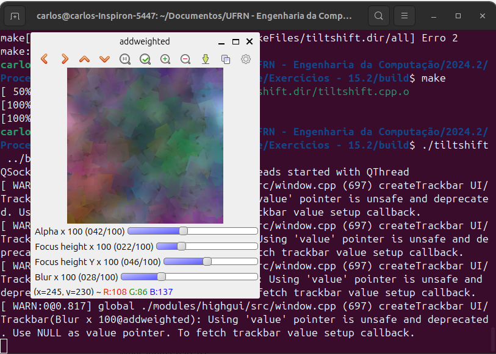

= Processamento Digital de Imagens (2024.2)
Carlos Antonio Miranda Filho <carlosantonio_miranda@hotmail.com>

== Cap 15 - Filtragem no domínio espacial 2 - Tilt-shift

O _tiltshift_ é uma técnica fotográfica que usa deslocamentos e rotações entre a lente e o plano de percepção (nde fica filme fotográfico ou o sensor da câmera) de modo a desfocar seletivamente regiões do assunto.

=== Exercícios 15.2

O programa será ajustado para regular a altura da região central que entrará em foco, a força de decaimento da região borrada e a posição vertical do centro da região que entrará em foco.

Primeiramente foram introduzidas variáveis que vão representar o valor mínimo e máximo das condições pedidas, neste caso os valores voltados para a região e o borramento (chamado aqui de _blur_), conforme mostrado no trecho abaixo:

[cpp]
----
//Parte do foco na altura
int focus_altura_slider = 0;
int focus_altura_slider_max = 100;

//Parte da força do decaimento da região borrada
int blur_slider = 0;
int blur_slider_max = 100;

//Parte do foco na região central
int focus_centro_slider = 0;
int focus_centro_slider_max = 100;
----

Para os efeitos, cálculos voltados para a região foram introduzidos:

[cpp]
----
int regiao_altura = focus_altura_slider * image2.rows/100;
int regiao_centro_y = focus_centro_slider * image2.rows/100;

int limit = top_slider*255/100;
  if(limit > 0){
    cv::Mat tmp = image2(cv::Rect(0, regiao_centro_y - regiao_altura/2, 256, regiao_altura));
    tmp.copyTo(imageTop(cv::Rect(0, regiao_centro_y - regiao_altura/2, 256, regiao_altura)));
  }

//Com o blur acima, aplico o borramento na imagem(desfoque)
int blur = blur_slider * 2 + 1;  //Fator de ajuste
  if (blur > 1) {
    cv::GaussianBlur(imageTop, imageTop, cv::Size(blur, blur), 0);
  }
----

Dentro da main, novas barras voltadas para as suas modificações foram introduzidas:

[cpp]
----
  // Controle deslizante para a altura da região em foco
  std::sprintf( TrackbarName, "Focus height x %d", focus_altura_slider_max);
  cv::createTrackbar( TrackbarName, "addweighted",
                      &focus_altura_slider,
                      focus_altura_slider_max,
                      on_trackbar_line );

  //Fazendo o controle para o centro da região em foco
  std::sprintf( TrackbarName, "Focus height Y x %d", focus_centro_slider_max);
  cv::createTrackbar( TrackbarName, "addweighted", 
                      &focus_centro_slider, 
                      focus_centro_slider_max,
                      on_trackbar_line );
  
  //Para o borramento (blur)
  std::sprintf( TrackbarName, "Blur x %d", blur_slider_max);
  cv::createTrackbar( TrackbarName, "addweighted", 
                      &blur_slider,
                      blur_slider_max,
                      on_trackbar_line );
----

Como resultado, um exemplo de imagem com os efeitos descritos encontra-se abaixo:

O código completo encontra-se abaixo:

[cpp]
----
#include <iostream>
#include <cstdio>
#include <opencv2/opencv.hpp>

double alfa;
int alfa_slider = 0;
int alfa_slider_max = 100;

int top_slider = 0;
int top_slider_max = 100;

//Parte do foco na altura
int focus_altura_slider = 0;
int focus_altura_slider_max = 100;

//Parte da força do decaimento da região borrada
int blur_slider = 0;
int blur_slider_max = 100;

//Parte do foco na região central
int focus_centro_slider = 0;
int focus_centro_slider_max = 100;

cv::Mat image1, image2, blended;
cv::Mat imageTop; 

char TrackbarName[50];

void on_trackbar_blend(int, void*){
 alfa = (double) alfa_slider/alfa_slider_max ;
 cv::addWeighted(image1, 1-alfa, imageTop, alfa, 0.0, blended);
 cv::imshow("addweighted", blended);
}

void on_trackbar_line(int, void*){
  //image1.copyTo(imageTop);
  image2.copyTo(imageTop);
  //Ajuste da altura da região em foco
  int regiao_altura = focus_altura_slider * image2.rows/100;
  int regiao_centro_y = focus_centro_slider * image2.rows/100;

  int limit = top_slider*255/100;
  if(limit > 0){
    cv::Mat tmp = image2(cv::Rect(0, regiao_centro_y - regiao_altura/2, 256, regiao_altura));
    tmp.copyTo(imageTop(cv::Rect(0, regiao_centro_y - regiao_altura/2, 256, regiao_altura)));
  }

  //Com o blur acima, aplico o borramento na imagem(desfoque)
  int blur = blur_slider * 2 + 1;  //Fator de ajuste
  if (blur > 1) {
    cv::GaussianBlur(imageTop, imageTop, cv::Size(blur, blur), 0);
  }

  on_trackbar_blend(alfa_slider,0);
}

int main(int argvc, char** argv){
  image1 = cv::imread(argv[1]);
  image2 = cv::imread(argv[2]);
  image2.copyTo(imageTop);
  cv::namedWindow("addweighted", 1);
  
  std::sprintf( TrackbarName, "Alpha x %d", alfa_slider_max );
  cv::createTrackbar( TrackbarName, "addweighted",
                      &alfa_slider,
                      alfa_slider_max,
                      on_trackbar_blend );
  on_trackbar_blend(alfa_slider, 0 );

  // Controle deslizante para a altura da região em foco
  std::sprintf( TrackbarName, "Focus height x %d", focus_altura_slider_max);
  cv::createTrackbar( TrackbarName, "addweighted",
                      &focus_altura_slider,
                      focus_altura_slider_max,
                      on_trackbar_line );

  //Fazendo o controle para o centro da região em foco
  std::sprintf( TrackbarName, "Focus height Y x %d", focus_centro_slider_max);
  cv::createTrackbar( TrackbarName, "addweighted", 
                      &focus_centro_slider, 
                      focus_centro_slider_max,
                      on_trackbar_line );
  
  //Para o borramento (blur)
  std::sprintf( TrackbarName, "Blur x %d", blur_slider_max);
  cv::createTrackbar( TrackbarName, "addweighted", 
                      &blur_slider,
                      blur_slider_max,
                      on_trackbar_line );

  cv::waitKey(0);
  return 0;
}
----

=== Exercícios 15.3

Aplicando os efeitos obtidos acima, pede-se para fazer um vídeo com a aplicação do efeito stop-motion nele. Os efeitos terão que percorrer nos pixels das imagens, de forma que serão criadas linhas e colunas para ela. Uma característica desse efeito é o foco na parte central de um vídeo, de forma que o que se encontra ao redor dele estará borrado, daí o efeito blur é aplicado nele, conforme mostrado no trecho a seguir:

[cpp]
----
    //Criando a máscara de foco central
    int rows = image.rows;
    int cols = image.cols;

    //A máscara terá uma região em foco (desfoque)
    cv::Mat mask = cv::Mat::zeros(image.size() ,CV_32F);

    //Área central do foco
    int top = std::max(0, focus_centro - focus_altura / 2);
    int bottom = std::min(rows, focus_centro + focus_altura / 2);

    //Criando a região central em foco
    mask(cv::Rect(0, top, cols, bottom-top)) = 1.0;

    //No stop-motion, as regiões fora do centro estarão desfocadas, aplico blur nelas
    cv::Mat blurred;
    cv::GaussianBlur(image, blurred, cv::Size(blur, blur), 0);
----

Percorrendo os pixels das imagens, os efeitos descritos acimas serão combinados:

[cpp]
----
    // Combina imagem original com desfoque baseado na máscara
    for (int r = 0; r < rows; r++) {
        for (int c = 0; c < cols; c++) {
            if (mask.at<float>(r, c) < 1.0) {
                image.at<cv::Vec3b>(r, c) = blurred.at<cv::Vec3b>(r, c);
            }
        }
    }
----

Na main, serão definidas as configurações de vídeo na saída, a intensidade do efeito borrão e os valores da altura e do centro da região em foco:

[cpp]
----
  //Vou definir as configurações de vídeo na saída
  int fourcc = cv::VideoWriter::fourcc('M', 'J', 'P', 'G');
  double fps = 10; // Taxa de quadros (stop motion com uma taxa baixa)
  cv::Size frame_size(image1.cols, image1.rows); // Tamanho dos quadros
  cv::VideoWriter video_writer("output_tilt_shift.avi", fourcc, fps, frame_size);

  // Definir parâmetros do efeito
  int focus_altura = 100; // Altura da região em foco
  int focus_centro = image1.rows / 2; // Centro da região em foco
  int blur = 21; // Intensidade do desfoque (deve ser ímpar)
----

Após essa etapa, um laço for é utilizado para salvar os quadros e aplicar o efeito tilt-shift no vídeo

[cpp]
----
    for (int i = 0; i < 100; ++i) {
        // Ajustar a posição e a altura do foco de acordo com o quadro
        focus_centro = image1.rows / 2 + (i % 10) * 10;
        
        // Aplica o efeito tilt-shift na imagem
        cv::Mat current_frame = image2.clone();
        efeito_tiltshift(current_frame, focus_altura, focus_centro, blur);

        // Escrever o quadro no arquivo de vídeo
        video_writer.write(current_frame);

        // Descartar quadros a cada 2 iterações para criar o efeito de stop motion
        if (i % 2 != 0) {
            continue;
        }
    }
----

O vídeo com os efeitos aplicados encontra-se abaixo:

media::output_tilt_shift.avi[]

O código completo:

[cpp]
----
#include <iostream>
#include <cstdio>
#include <opencv2/opencv.hpp>

double alfa;
int alfa_slider = 0;
int alfa_slider_max = 100;

int top_slider = 0;
int top_slider_max = 100;

cv::Mat image1, image2, blended;
cv::Mat imageTop; 

char TrackbarName[50];

void on_trackbar_blend(int, void*){
 alfa = (double) alfa_slider/alfa_slider_max ;
 cv::addWeighted(image1, 1-alfa, imageTop, alfa, 0.0, blended);
 cv::imshow("addweighted", blended);
}

void on_trackbar_line(int, void*){
  image1.copyTo(imageTop);
  int limit = top_slider*255/100;
  if(limit > 0){
    cv::Mat tmp = image2(cv::Rect(0, 0, 256, limit));
    tmp.copyTo(imageTop(cv::Rect(0, 0, 256, limit)));
  }
  on_trackbar_blend(alfa_slider,0);
}

void efeito_tiltshift(cv::Mat& image, int focus_altura, int focus_centro, int blur) {
    //Criando a máscara de foco central
    int rows = image.rows;
    int cols = image.cols;

    //A máscara terá uma região em foco (desfoque)
    cv::Mat mask = cv::Mat::zeros(image.size() ,CV_32F);

    //Área central do foco
    int top = std::max(0, focus_centro - focus_altura / 2);
    int bottom = std::min(rows, focus_centro + focus_altura / 2);

    //Criando a região central em foco
    mask(cv::Rect(0, top, cols, bottom-top)) = 1.0;

    //No stop-motion, as regiões fora do centro estarão desfocadas, aplico blur nelas
    cv::Mat blurred;
    cv::GaussianBlur(image, blurred, cv::Size(blur, blur), 0);

    // Combina imagem original com desfoque baseado na máscara
    for (int r = 0; r < rows; r++) {
        for (int c = 0; c < cols; c++) {
            if (mask.at<float>(r, c) < 1.0) {
                image.at<cv::Vec3b>(r, c) = blurred.at<cv::Vec3b>(r, c);
            }
        }
    }
}

int main(int argvc, char** argv){
  image1 = cv::imread(argv[1]);
  image2 = cv::imread(argv[2]);
  image2.copyTo(imageTop);

  //Vou definir as configurações de vídeo na saída
  int fourcc = cv::VideoWriter::fourcc('M', 'J', 'P', 'G');
  double fps = 10; // Taxa de quadros (stop motion com uma taxa baixa)
  cv::Size frame_size(image1.cols, image1.rows); // Tamanho dos quadros
  cv::VideoWriter video_writer("output_tilt_shift.avi", fourcc, fps, frame_size);

  // Definir parâmetros do efeito
  int focus_altura = 100; // Altura da região em foco
  int focus_centro = image1.rows / 2; // Centro da região em foco
  int blur = 21; // Intensidade do desfoque (deve ser ímpar)

  // Aplicar o efeito Tilt-Shift e salvar os quadros
    for (int i = 0; i < 100; ++i) {
        // Ajustar a posição e a altura do foco de acordo com o quadro
        focus_centro = image1.rows / 2 + (i % 10) * 10;
        
        // Aplica o efeito tilt-shift na imagem
        cv::Mat current_frame = image2.clone();
        efeito_tiltshift(current_frame, focus_altura, focus_centro, blur);

        // Escrever o quadro no arquivo de vídeo
        video_writer.write(current_frame);

        // Descartar quadros a cada 2 iterações para criar o efeito de stop motion
        if (i % 2 != 0) {
            continue;
        }
    }

    // Liberar o vídeo
    video_writer.release();

    std::cout << "Vídeo salvo como output_tilt_shift.avi" << std::endl;

  //cv::waitKey(0);
  return 0;
}
----
