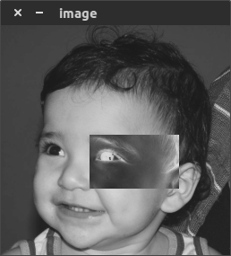
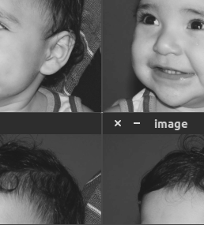

= Processamento Digital de Imagens (2024.2)
Carlos Antonio Miranda Filho <carlosantonio_miranda@hotmail.com>

== Cap 2 - Manipulando pixels numa imagem

=== Exercícios 2.1

O exercício trata de pegar uma imagem, escolher um determinado trecho da sua região e com ele fazer uma manipulação para inverter as cores deste trecho. Através da biblioteca OpenCV, faz-se primeiro o teste para verificar se a imagem será executada, de forma que será utilizado um comando que forçará a imagem a ser lida e mostrada em tons de cinza (cv::IMREAD_GRAYSCALE).

Adiante, dois laços for são adicionados no código para percorrer os pixels da imagem. Dentro do for, o espaço delimitado para a região negativa vai dos pontos (150, 210) até (100, 200), considerando que o tamanho da imagem seja 256x256. O trecho com os laços for encontra-se abaixo:

//trecho para os laços for do código
----
    for(int i=150; i<210; i++) {    //originalmente a imagem tem tamanho 256x256
        for (int j= 100; j<200; j++) {
            image.at<uchar>(i,j) = 255 - image.at<uchar>(i,j);  //assim posso obter o negativo 
                                                                //pelo trecho da imagem
        }
    }
----

O efeito negativo ocorre ao pegar o valor máximo do pixel (em um intervalo que vai de 0 a 255) e faço a subtração com o trecho correspondente ao que os laços percorre por largura e altura. A consequência é o trecho da imagem sendo mostrada com as cores invertidas gerado por cada valor dessa operação. Abaixo encontra-se o resultado da imagem:

O código completo encontra-se adiante:

----
#include <iostream>
#include <opencv2/opencv.hpp>

int main(int, char**) {
    cv::Mat image;

    image = cv::imread("biel.png", cv::IMREAD_GRAYSCALE);
    if(!image.data) std::cout << "Não abriu a imagem" << std::endl;

    cv::namedWindow("negativo", cv::WINDOW_AUTOSIZE);

    for(int i=150; i<210; i++) {    //originalmente a imagem tem tamanho 256x256
        for (int j= 100; j<200; j++) {
            image.at<uchar>(i,j) = 255 - image.at<uchar>(i,j);  //assim posso obter o negativo pelo trecho da imagem
        }
    }
    //peguei os valores de i e j de forma que subtrai-os pelo valor 255, 
    //cada valor gerado resulta no negativo do trecho
    cv::imshow("negativo", image);
    cv::waitKey();

}
----

=== Exercícios 2.2

A mesma imagem objeto de estudo no exercício anterior também foi usada para fazer a troca de posições nela. Primeiro foi feita uma verificação do tamanho da imagem para saber se ela pode ser separada por quadrantes, caso a largura e a altura tenham tamanhos pares a troca poderá ser realizada.

----
if (altura % 2 != 0 || largura %2 != 0) std::cout << "A imagem não pode ser separada em quadrantes" << std::endl;
----

Através da biblioteca OpenCV, foi recorrida ao comando Rect para fazer a manipulação de regiões, de forma que cada região foi dividida em direita e esquerda, cada uma com superior e inferior, conforme mostrado no trecho abaixo:

----
    cv::Rect q1(0, 0, largura/2, altura/2);                 //Superior esquerdo
    cv::Rect q2(largura/2, 0, largura/2, altura/2);         //Superior direito
    cv::Rect q3(0, altura/2, largura/2, altura/2);          //Inferior esquerdo
    cv::Rect q4(largura/2, altura/2, largura/2, altura/2);  //Inferior direito
----

Após ter feito isso, foi necessário fazer uma cópia da imagem original, senão o código irá sobrescever a imagem original. A consequência disso é que uma única posição da imagem se repete nos demais quadrantes. O trecho das cópias encontra-se abaixo:

----
    //com a cópia feita, pego as modificações feitas no Rect para atribuir a essa cópia
    image(q1).copyTo(imageCopia(q4));       //aqui p. ex., troco q1 do original pela q4 da cópia
    image(q2).copyTo(imageCopia(q3));
    image(q3).copyTo(imageCopia(q2));
    image(q4).copyTo(imageCopia(q1));
----

O resultado da troca encontra-se adiante:

O código completo encontra-se abaixo:

----
#include <iostream>
#include <opencv2/opencv.hpp>

int main(int, char**) {
    cv::Mat image;

    image = cv::imread("biel.png", cv::IMREAD_GRAYSCALE);
    if(!image.data) std::cout << "Não abriu a imagem" << std::endl;

    cv::namedWindow("troca", cv::WINDOW_AUTOSIZE);

    //image.cols = largura da imagem; image.rows = altura da imagem
    int altura = image.rows;
    int largura = image.cols;

    if (altura % 2 != 0 || largura %2 != 0) std::cout << "A imagem não pode ser separada em quadrantes" << std::endl;

    //A biblioteca OpenCV permite fazer manipulação de regiões através do comando Rect
    //Rect q(x, y, largura, altura)
    cv::Rect q1(0, 0, largura/2, altura/2);                 //Superior esquerdo
    cv::Rect q2(largura/2, 0, largura/2, altura/2);         //Superior direito
    cv::Rect q3(0, altura/2, largura/2, altura/2);          //Inferior esquerdo
    cv::Rect q4(largura/2, altura/2, largura/2, altura/2);  //Inferior direito

    cv:: Mat imageCopia = image.clone();

    //com a cópia feita, pego as modificações feitas no Rect para atribuir a essa cópia
    image(q1).copyTo(imageCopia(q4));       //aqui p. ex., troco q1 do original pela q4 da cópia
    image(q2).copyTo(imageCopia(q3));
    image(q3).copyTo(imageCopia(q2));
    image(q4).copyTo(imageCopia(q1));

    cv::imshow("original", image);
    cv::imshow("troca", imageCopia);
    cv::waitKey();
}
----
