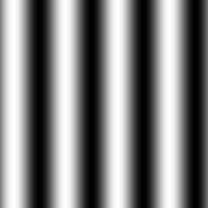

= Processamento Digital de Imagens (2024.2)
Carlos Antonio Miranda Filho <carlosantonio_miranda@hotmail.com>

== Cap 5 - Serialização de dados em ponto flutuante via FileStorage

O armazenamento de dados em forma de ponto flutuante é usado em casos para se obter imagens de alta dinâmica, imagens de profundidade ou máscaras usadas em filtros digitais, só para citar alguns exemplos. As imagens aqui estão armazenadas em um tipo _float_ ou _double_ e a biblioteca do OpenCV usa um comando chamado <b>FileStorage</b> para armazenar seus valores em diferentes tipos de arquivos. Para o exercício deste capítulo, o formato escolhido foi _yaml_.

=== Exercícios 5.2

Para este exercício, as dimensões da imagens são do tipo 256x256 pixels que contém uma senóide de 4 períodos e amplitude igual a 127 desenhada na horizontal. Inicialmente foi feito os comandos para o nome do arquivo, o formato e o tipo de dado para o código (que neste caso será de 32 bits), o trecho inicial encontra-se abaixo:

----
  std::stringstream ss_img, ss_yml; //cria uma string com o nome do arquivo na saída
  cv::Mat image;

  ss_yml << "senoide-" << SIDE << ".yml"; //SIDE é a constante e yml é o formato que terá o arquivo
  image = cv::Mat::zeros(SIDE, SIDE, CV_32FC1); //vai representar um dado em 32 bits em ponto flutuante
                                                //em um só canal

  cv::FileStorage fs(ss_yml.str(), cv::FileStorage::WRITE);
----

Para o <b>FileStorage</b>, seu primeiro parâmetro é o arquivo de saída, seu segundo parâmetro é o modo de abertura do arquivo. Neste caso,  o modo de abertura é cv::FileStorage::WRITE, o que indica que o arquivo será aberto para escrita, permitindo a gravação da imagem gerada em ponto flutuante.

Dando continuidade ao código, o laço for vai percorrer todos os elementos da matriz image, como o tamanho é do tipo 256x256, ambas percorrerão o mesmo valor SIDE e cada elemento percorrido terá um valor atribuído ao brilho por conta da amplitude da senóide naquele ponto. O trecho encontra-se abaixo:

----
    for (int i = 0; i < SIDE; i++) {
        for (int j = 0; j < SIDE; j++) {
            image.at<float>(i, j) = 127 * sin(2 * M_PI * PERIODOS * j / SIDE) + 128;
    }
  }
----

Graças ao tamanho, os valores da senóide deverão ficar entre o intervalo 0 e 255. Para que isso seja possível, o valor 127 é multiplicado pelo trecho da senóide e somado com 128 em seguida. O resultado encontra-se a seguir:

O desenho mostrado acima mostra um padrão ondulado que seria correspondente ao desenho de uma onda senoidal. As regiões mais escuras correspondem aos pontos de mínimo da senóide e as regiões mais claras correspondem aos pontos de máximo da senóide.

Um trecho do arquivo _yml_ mostra os valores computados pelo código:

----
%YAML:1.0
mat: !!opencv-matrix
   rows: 256
   cols: 256
   dt: f
   data: [ 128., 1.40448181e+02, 1.52776474e+02, 1.64866150e+02,
       1.76600800e+02, 1.87867386e+02, 1.98557419e+02, 2.08567947e+02,
       2.17802567e+02, 2.26172333e+02, 2.33596634e+02, 2.40003998e+02,
       2.45332703e+02, 2.49531418e+02, 2.52559738e+02, 2.54388458e+02,
       255., 2.54388458e+02, 2.52559738e+02, 2.49531418e+02,
       2.45332703e+02, 2.40003998e+02, 2.33596634e+02, 2.26172333e+02,
       2.17802567e+02, 2.08567947e+02, 1.98557419e+02, 1.87867386e+02,
       1.76600800e+02, 1.64866150e+02, 1.52776474e+02, 1.40448181e+02,
----

Ao diminuir os períodos, o observado foi que a região clara aparecem em menores
quantidades, porém elas são mais longas em comparação com a imagem do exemplo. Da mesma
forma se observa para as regiões mais escuras. Caso o número de períodos de senóide fosse aumentado para 8, o resultado em forma de imagem seria:

image::exercicio5_senoide_periodo8.png[]

Voltando para o caso do número de períodos igual a 4, o código completo encontra-se abaixo:

[filestorage.cpp, cpp]
----
#include <iostream>
#include <opencv2/opencv.hpp>
#include <sstream>
#include <string>

int SIDE = 256;
int PERIODOS = 4;

int main (int argc, char** argv) {
    std::stringstream ss_img, ss_yml;
    cv::Mat image;

    ss_yml << "senoide- " << SIDE << ".yml";    //SIDE é a constante e yml é o formato que terá o arquivo
    image = cv::Mat::zeros(SIDE, SIDE, CV_32FC1); //vai representar um dado em 32 bits em ponto flutuante
                                                //em um só canal

    cv::FileStorage fs(ss_yml.str(), cv::FileStorage::WRITE);

    for (int i = 0; i < SIDE; i++) {
        for (int j = 0; j < SIDE; j++) {
            image.at<float>(i, j) = 127 * sin(2 * M_PI * PERIODOS * j / SIDE) + 128;
    }
  }

  fs << "mat" << image;
  fs.release();

  cv::normalize(image, image, 0, 255, cv::NORM_MINMAX);
  image.convertTo(image, CV_8U);
  ss_img << "senoide-" << SIDE << ".png";
  cv::imwrite(ss_img.str(), image);

  fs.open(ss_yml.str(), cv::FileStorage::READ);
  fs["mat"] >> image;

  cv::normalize(image, image, 0, 255, cv::NORM_MINMAX);
  image.convertTo(image, CV_8U);

  cv::imshow("image", image);
  cv::waitKey();

  return 0;
}
----

A serialização dos resultados é obtida através do trecho:

----
fs << "mat" << image;
---- 

enquanto que a linha seguinte
---- 
 fs.release();
---- 
fecha o fluxo de arquivo para a saída.