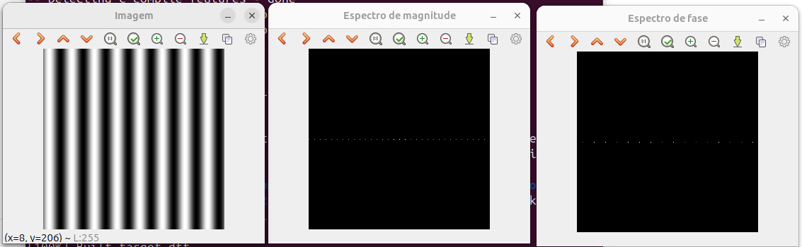
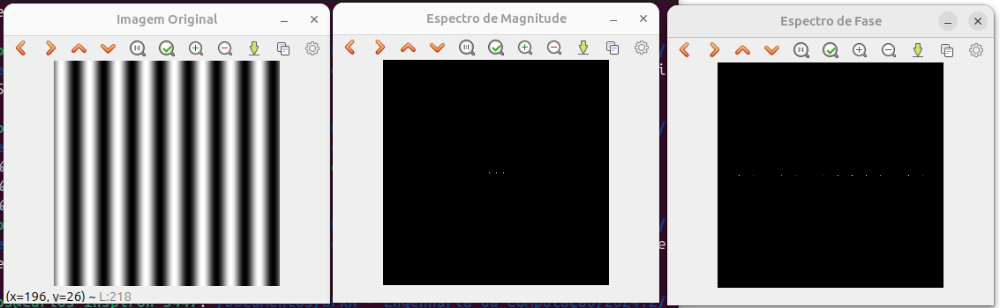

= Processamento Digital de Imagens (2024.2)
Carlos Antonio Miranda Filho <carlosantonio_miranda@hotmail.com>

== Cap 16 - A Transformada Discreta de Fourier

Quando temos sinais, eles estão representados em função do tempo.contínuo Ao passarmos para o tempo discreto, esses sinais são amostrados e elencados em função da frequência, depois eles são representados como se fossem uma soma de vários senos com diferentes frequências e deslocamentos de fases do tempo. Essa representação é chamada de ``**__Transformada de Fourier__**``. No caso das imagens digitais, o processo se dá através da ``**__Transformada Discreta de Fourier (TDF)__**``.

Ao submeter uma imagem à TDF, existem fontes de sinais que geram ruídos. Por definição, uma imagem possui um espectro para a magnitude e outro para a fase, sua imagem é preto ou branco devido ao caráter periódico da função seno. A imagem é composta de senóides horizontal e vertical e é filtrada de acordo com as partes geradas e calculadas na transformada e no espectro de magnitude.

=== Exercícios 16.2

Para este capítulo, a imagem objeto de estudo encontra-se abaixo:

image::senoide-256.png[]

A partir dela, o código da TDF será usada para extrair informações sobre ela. No código, primeiro é feito preenchimento de zeros à direita para as partes real e imaginária. Em seguida, os planos são combinados numa única estrutura de dados complexa e o cálculo da TDF é realizado. Após isso, é feito cálculo dos espectros de magnitude e da fase. O resultado do que foi feito encontra-se a seguir:

Originalmente temos uma imagem senoidal periódica com 256x256 pixels com linhas em preto e branco alternadas verticalmente. Ao fazer a exibição do espectro de magnitude, o que se observa é que apenas pontos brancos estão sendo mostrados horizontalmente, de forma que eles se repetem no mesmo sentido. Em virtude da imagem original não possui periodicidade de forma horizontal, apenas pontos na vertical são observados na sua magnitude, com três valores no centro possivelmente indicarem os maios valores por estarem com pontos mais brancos.

Para o espectro de fase, foram observadas variações de intensidades entre os pontos horizontais, elas podem estar relacionadas com as alternâncias entre as faixas pretas e brancas do senóide original. O código da questão encontra-se abaixo:

[cpp]
----
#include <iostream>
#include <opencv2/opencv.hpp>
#include <vector>

void swapQuadrants(cv::Mat& image) {
    cv::Mat tmp, A, B, C, D;

  // se a imagem tiver tamanho impar, recorta a regiao para o maior
  // tamanho par possivel (-2 = 1111...1110)
  image = image(cv::Rect(0, 0, image.cols & -2, image.rows & -2));

  int centerX = image.cols/2;
  int centerY = image.rows/2;

  // rearranja os quadrantes da transformada de Fourier de forma que
  // a origem fique no centro da imagem
  // A B   ->  D C
  // C D       B A
  A = image(cv::Rect(0, 0, centerX, centerY));
  B = image(cv::Rect(centerX, 0, centerX, centerY));
  C = image(cv::Rect(0, centerY, centerX, centerY));
  D = image(cv::Rect(centerX, centerY, centerX, centerY));

  // swap quadrants (Top-Left with Bottom-Right)
  A.copyTo(tmp);
  D.copyTo(A);
  tmp.copyTo(D);

  // swap quadrant (Top-Right with Bottom-Left)
  C.copyTo(tmp);
  B.copyTo(C);
  tmp.copyTo(B);
}

int main(int argc, char** argv) {
    cv::Mat image, padded, complexImage;
    std::vector<cv::Mat> planos;

    image = cv::imread(argv[1], cv::IMREAD_GRAYSCALE);
    if (image.empty()) {
        std::cout << "Erro ao abrir a image" << argv[1] << std::endl;
        return EXIT_FAILURE;
    }

  // expande a imagem de entrada para o melhor tamanho no qual a DFT pode ser
  // executada, preenchendo com zeros a lateral inferior direita.
  int dft_M = cv::getOptimalDFTSize(image.rows);
  int dft_N = cv::getOptimalDFTSize(image.cols);
  cv::copyMakeBorder(image, padded, 0, dft_M - image.rows, 0,
                     dft_N - image.cols, cv::BORDER_CONSTANT, 
                     cv::Scalar::all(0));
  
  // prepara a matriz complexa para ser preenchida
  // primeiro a parte real, contendo a imagem de entrada
  planos.push_back(cv::Mat_<float>(padded));
  // depois a parte imaginaria com valores nulos
  planos.push_back(cv::Mat::zeros(padded.size(), CV_32F));

  // combina os planos em uma unica estrutura de dados complexa
  cv::merge(planos, complexImage);

  // calcula a DFT
  cv::dft(complexImage, complexImage);
  swapQuadrants(complexImage);

  // planos[0] : Re(DFT(image)
  // planos[1] : Im(DFT(image)
  cv::split(complexImage, planos);

  // calcula o espectro de magnitude a fase (em radianos)
  cv::Mat magn, fase;
  cv::cartToPolar(planos[0], planos[1], magn, fase, false);
  cv::normalize(fase, fase, 0, 1, cv::NORM_MINMAX);

  // caso deseje apenas o espectro da magnitude da DFT, use:
  cv::magnitude(planos[0], planos[1], magn);

  // some uma constante para evitar log(0)
  // log(1 + sqrt(Re(DFT(image))^2 + Im(DFT(image))^2))
  magn += cv::Scalar::all(1);

  // calcula o logaritmo da magnitude para exibir
  // com compressao de faixa dinamica
  cv::log(magn, magn);
  cv::normalize(magn, magn, 0, 1, cv::NORM_MINMAX);

  // exibe as imagens processadas
  cv::imshow("Imagem", image);
  cv::imshow("Espectro de magnitude", magn);
  cv::imshow("Espectro de fase", fase);

  cv::waitKey();
  return EXIT_SUCCESS;
}
----

=== Exercícios 16.3

Aqui é feito a leitura .yml da senóide 256x256 da imagem do capítulo 5. Aqui, com o arquivo .yml, vou convertê-lo em imagem e fazer a exibição dos espectros de magnitude e fase nele presente, de forma que o que será exibido encontra-se a seguir:

Ao contrário do caso anterior, aqui somente os três pontos centrais do espectro de magnitude são exibidos. Comparando a imagem formada através do arquivo com a imagem original, os períodos estão ligeiramente diferentes, com as faixas brancas sensivelmente mais destacáveis e menos separáveis entre eles, consequentemente as faixas pretas do sinal periódico parecem menores.

No espectro de fase, nota-se que as variações de intensidade dos pontos brancos que eram marcantes visualmente no exercício 16.2 não estão tão vistos, estando eles concentrados mais na parte direita (ao contrário do exercício anterior, que estão mais à esquerda e possui pontos mais brancos). O que acontece aqui é similar à Transformada Inversa de Fourier, temos um arquivo que vai ser passado pra sinal, o que se nota foram atenuações dos sinais ao visualizar os espectors de magnitude e de fase.

O código da questão encontra-se adiante:

[cpp]
----
#include <iostream>
#include <opencv2/opencv.hpp>
#include <vector>

void swapQuadrants(cv::Mat& image) {
    cv::Mat tmp, A, B, C, D;

    image = image(cv::Rect(0, 0, image.cols & -2, image.rows & -2));

    int centerX = image.cols / 2;
    int centerY = image.rows / 2;

    A = image(cv::Rect(0, 0, centerX, centerY));
    B = image(cv::Rect(centerX, 0, centerX, centerY));
    C = image(cv::Rect(0, centerY, centerX, centerY));
    D = image(cv::Rect(centerX, centerY, centerX, centerY));

    A.copyTo(tmp);
    D.copyTo(A);
    tmp.copyTo(D);

    C.copyTo(tmp);
    B.copyTo(C);
    tmp.copyTo(B);
}

int main(int argc, char** argv) {
    cv::Mat image, padded, complexImage;
    std::vector<cv::Mat> planos;

    if (argc != 2) {
        std::cerr << "Uso: " << argv[0] << " <arquivo.yml>" << std::endl;
        return EXIT_FAILURE;
    }

    // Carrega o arquivo YAML
    cv::FileStorage fs(argv[1], cv::FileStorage::READ);
    if (!fs.isOpened()) {
        std::cerr << "Erro ao abrir o arquivo: " << argv[1] << std::endl;
        return EXIT_FAILURE;
    }

    // Lê a matriz de ponto flutuante do arquivo
    fs["image"] >> image;
    fs.release();

    if (image.empty()) {
        std::cerr << "Erro: Matriz 'image' está vazia no arquivo YAML." << std::endl;
        return EXIT_FAILURE;
    }

    // Certifica-se de que a imagem está em ponto flutuante
    if (image.type() != CV_32F) {
        std::cerr << "Erro: A matriz deve estar em formato de ponto flutuante (CV_32F)." << std::endl;
        return EXIT_FAILURE;
    }

    // Prepara a imagem para a DFT
    int dft_M = cv::getOptimalDFTSize(image.rows);
    int dft_N = cv::getOptimalDFTSize(image.cols);
    cv::copyMakeBorder(image, padded, 0, dft_M - image.rows, 0,
                       dft_N - image.cols, cv::BORDER_CONSTANT, 
                       cv::Scalar::all(0));

    planos.push_back(padded); // Parte real
    planos.push_back(cv::Mat::zeros(padded.size(), CV_32F)); // Parte imaginária

    cv::merge(planos, complexImage);

    // Calcula a DFT
    cv::dft(complexImage, complexImage);
    swapQuadrants(complexImage);

    cv::split(complexImage, planos);

    // Calcula o espectro de magnitude e fase
    cv::Mat magn, fase;
    cv::cartToPolar(planos[0], planos[1], magn, fase, false);
    cv::normalize(fase, fase, 0, 1, cv::NORM_MINMAX);

    magn += cv::Scalar::all(1);
    cv::log(magn, magn);
    cv::normalize(magn, magn, 0, 1, cv::NORM_MINMAX);

    cv::normalize(image, image, 0, 255, cv::NORM_MINMAX);
    image.convertTo(image, CV_8U); // Converte para 8 bits

    // Exibe os resultados
    cv::imshow("Imagem Original", image);
    cv::imshow("Espectro de Magnitude", magn);
    cv::imshow("Espectro de Fase", fase);

    cv::waitKey();
    return EXIT_SUCCESS;
}
----