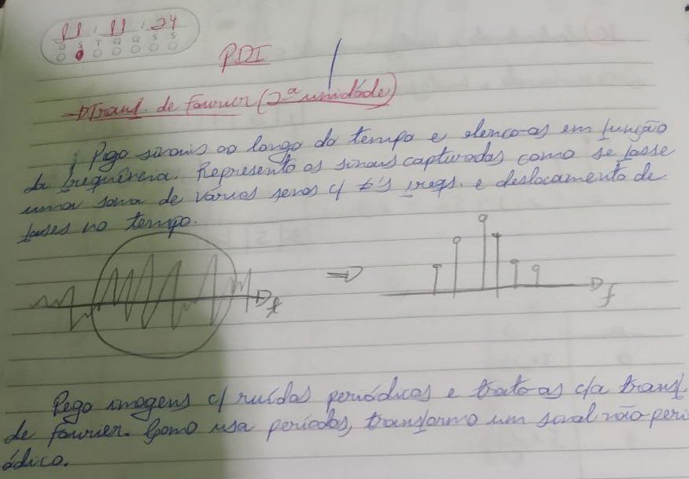
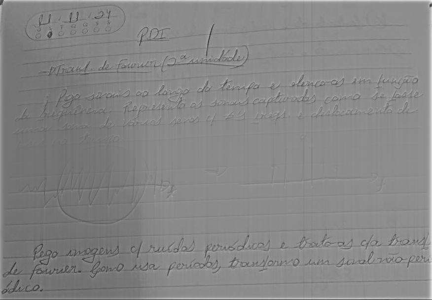
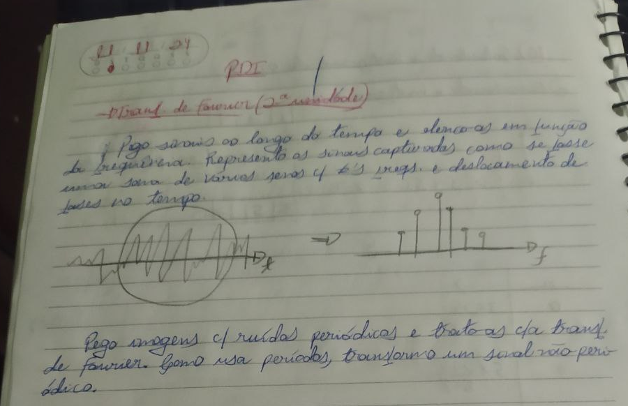
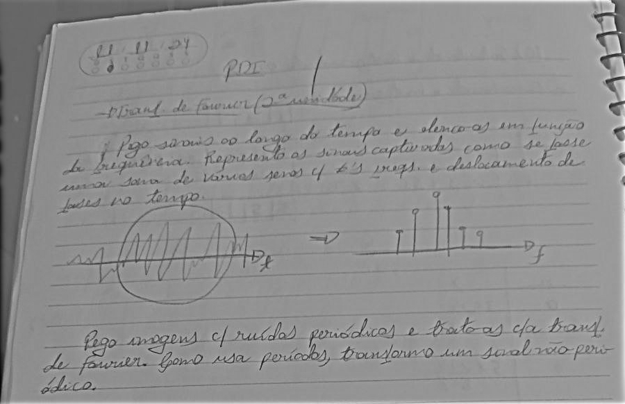

= Processamento Digital de Imagens (2024.2)
Carlos Antonio Miranda Filho <carlosantonio_miranda@hotmail.com>

== Cap 17 - Filtragem no Domínio da Frequência

O capítulo trata da aplicação dos filtros da Transformada Discreta de Fourier. Aqui o filtro vai ser usado é um filtro homomórfico, que será aplicado numa imagem com iluminação não muito favorável à qualidade. Este tipo de filtro é comumente aplicado em imagens radiológicas, não seguindo o mesmo padrão de aquisição das imagens fotográficas.

=== Exercícios 17.2

A imagem utilizada para o teste encontra-se abaixo:

Uma característica da foto é que ela possui uma sobra que indica a posição na qual foi tirada do trecho do caderno. O filtro homomórfico pode ser aplicado tanto através do Gaussiano quanto do Butterworth. Em ambos, o filtro homomórfico atua através de parâmetros de ganhos de baixa e alta frequência que servem para atenuá-las (representadas pela letra grega _gama_ &#947;). Para esta atividade, foi optado por usar um filtro tipo gaussiano para as aplicações de filtro homomórfico.

Por utilizar TDF, o código reaproveita as trocas de quadrantes do capítulo anterior, só que agora uma função voltada para o filtro homomórfico será adicionada.

[cpp]
----
void makeGaussianHomomorphicFilter(const cv::Mat &image, cv::Mat &filter, float gammaH, float gammaL, float D0) {
    cv::Mat_<float> filter2D(image.rows, image.cols);
    int centerX = image.cols / 2;
    int centerY = image.rows / 2;

    for (int i = 0; i < image.rows; i++) {
        for (int j = 0; j < image.cols; j++) {
            // Calcula a distância do centro no espaço de frequência
            float D = sqrt(pow(i - centerY, 2) + pow(j - centerX, 2));
            
            // Calcula o filtro homomórfico Gaussiano
            float H = (gammaH - gammaL) * (1.0 - exp(-D * D / (2 * D0 * D0))) + gammaL;
            filter2D.at<float>(i, j) = H;
        }
    }
----

O resultado da aplicação da filtragem:

O filtro conseguiu atenuar a parte pouca iluminada provocada pela sombra da imagem original, no entanto ele não conseguiu passar todos os detalhes das partes escritas à lápis comum que corresponde aos gráficos dos sinais do trecho da imagem.

Para os dados do caso gaussiano, os valores de &#947; (H e L, respectivamente) e do raio de corte encontra-se a seguir:

[cpp]
----
  cv::Mat filter;
  makeGaussianHomomorphicFilter(complexImage, filter, 2.0, 0.5, 30.0);  //gamaH = 2.0, gamaL = 0.5, D0 (raio de corte) = 30
  cv::mulSpectrums(complexImage, filter, complexImage, 0);
----

Ainda foi feito um teste para uma segunda foto, desta vez sem uma sombra a ser formada:

Ao aplicar o filtro o resultado tornou-se um pouco mais satisfatório, conforme mostrado a seguir:

O código completo encontra-se abaixo:

[cpp]
----
#include <iostream>
#include <vector>
#include <opencv2/opencv.hpp>

void swapQuadrants(cv::Mat& image) {
  cv::Mat tmp, A, B, C, D;

  // se a imagem tiver tamanho impar, recorta a regiao para o maior
  // tamanho par possivel (-2 = 1111...1110)
  image = image(cv::Rect(0, 0, image.cols & -2, image.rows & -2));

  int centerX = image.cols / 2;
  int centerY = image.rows / 2;

  // rearranja os quadrantes da transformada de Fourier de forma que 
  // a origem fique no centro da imagem
  // A B   ->  D C
  // C D       B A
  A = image(cv::Rect(0, 0, centerX, centerY));
  B = image(cv::Rect(centerX, 0, centerX, centerY));
  C = image(cv::Rect(0, centerY, centerX, centerY));
  D = image(cv::Rect(centerX, centerY, centerX, centerY));

  // swap quadrants (Top-Left with Bottom-Right)
  A.copyTo(tmp);
  D.copyTo(A);
  tmp.copyTo(D);

  // swap quadrant (Top-Right with Bottom-Left)
  C.copyTo(tmp);
  B.copyTo(C);
  tmp.copyTo(B);
}

//o filtro homomórfico utilizado é do tipo Butterworth
void makeHommomorphicFilter(const cv::Mat &image, cv::Mat &filter, float gammaL, float gammaH, 
                            float D0, int n){
  cv::Mat_<float> filter2D(image.rows, image.cols);
  int centerX = image.cols / 2;
  int centerY = image.rows / 2;
  int radius = 20;

  for (int i = 0; i < image.rows; i++) {
    for (int j = 0; j < image.cols; j++) {
      float D = sqrt(pow(i - centerY, 2) + pow(j - centerX, 2));
      float H = (gammaH - gammaL) * (1.0 - 1.0 / (1.0 + pow(D / D0, 2 * n))) + gammaL;
      filter2D.at<float>(i, j) = H;
    }
  }

  //vou criar uma matriz de dois canais, um pra parte real e outro pra imaginária
  cv::Mat planes[] = {cv::Mat_<float>(filter2D), cv::Mat::zeros(filter2D.size(), CV_32F)};
  cv::merge(planes, 2, filter); //aqui cria a matriz de dois canais
}

int main(int argc, char** argv) {
  cv::Mat image, padded, complexImage;
  std::vector<cv::Mat> planos; 

  image = imread(argv[1], cv::IMREAD_GRAYSCALE);
  if (image.empty()) {
    std::cout << "Erro abrindo imagem" << argv[1] << std::endl;
    return EXIT_FAILURE;
  }

  // expande a imagem de entrada para o melhor tamanho no qual a DFT pode ser
  // executada, preenchendo com zeros a lateral inferior direita.
  int dft_M = cv::getOptimalDFTSize(image.rows);
  int dft_N = cv::getOptimalDFTSize(image.cols); 
  cv::copyMakeBorder(image, padded, 0, dft_M - image.rows, 0, dft_N - image.cols, cv::BORDER_CONSTANT, cv::Scalar::all(0));

  // prepara a matriz complexa para ser preenchida
  // primeiro a parte real, contendo a imagem de entrada
  planos.push_back(cv::Mat_<float>(padded)); 
  // depois a parte imaginaria com valores nulos
  planos.push_back(cv::Mat::zeros(padded.size(), CV_32F));

  // combina os planos em uma unica estrutura de dados complexa
  cv::merge(planos, complexImage);  

  // calcula a DFT
  cv::dft(complexImage, complexImage); 
  swapQuadrants(complexImage);

  // cria o filtro ideal e aplica a filtragem de frequencia
  cv::Mat filter;
  makeHommomorphicFilter(complexImage, filter, 2.0, 0.5, 30.0, 2);  //gamaH = 2.0, gamaL = 0.5, D0 (raio de corte) = 30, n = 2 (ordem do filtro tipo Butterworth)
  cv::mulSpectrums(complexImage, filter, complexImage, 0);

  // calcula a DFT inversa
  swapQuadrants(complexImage);
  cv::idft(complexImage, complexImage);

  // planos[0] : Re(DFT(image)
  // planos[1] : Im(DFT(image)
  cv::split(complexImage, planos);  //aqui faz a divisão da imagem multicanal em duas matrizes: real e imaginária

  // recorta a imagem filtrada para o tamanho original
  // selecionando a regiao de interesse (roi)
  cv::Rect roi(0, 0, image.cols, image.rows); //A imagem filtrada é obtida selecionando a roi correspondente ao tamanho original da imagem de entrada
  cv::Mat result = planos[0](roi); //A imagem filtrada é armazenada na variável e normalizada para exibição

  // normaliza a parte real para exibicao
  cv::normalize(result, result, 0, 1, cv::NORM_MINMAX);

  cv::imshow("image", result);
  cv::imwrite("dft-filter.png", result * 255);

  cv::waitKey();
  return EXIT_SUCCESS;
}
----

