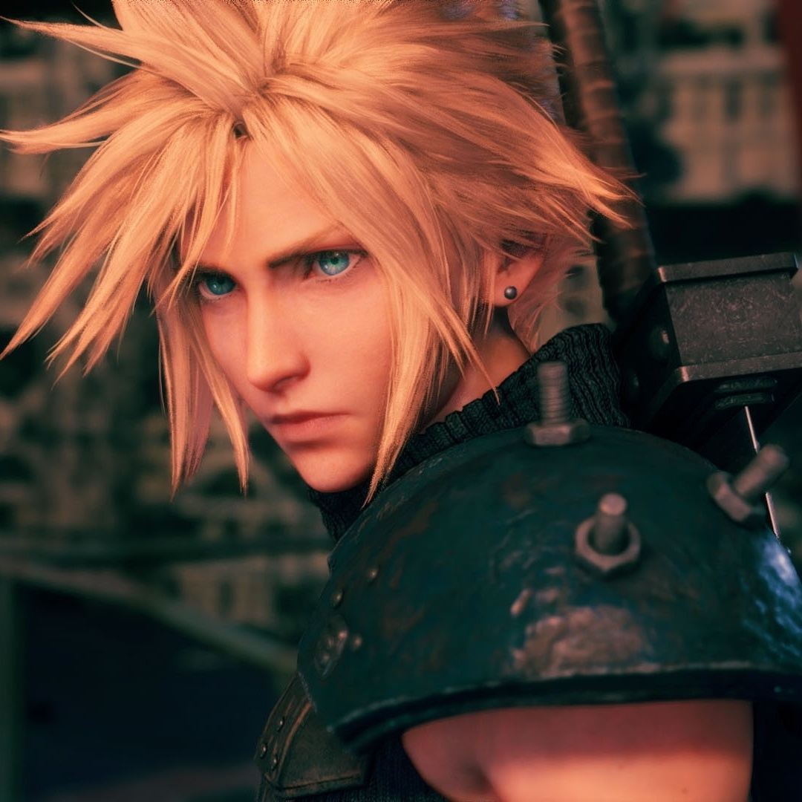
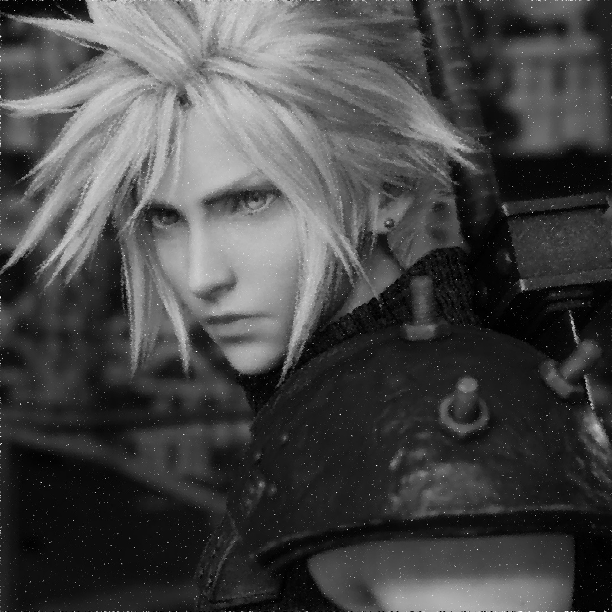
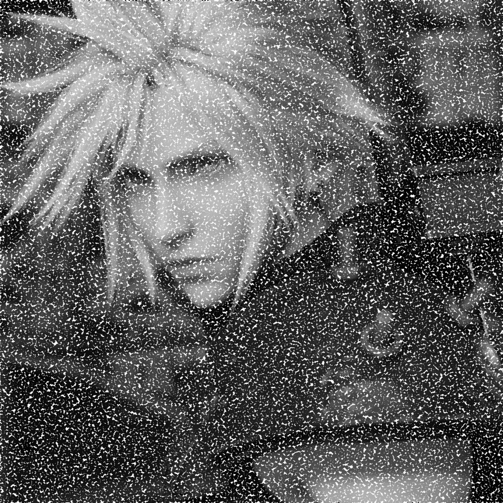

= Processamento Digital de Imagens (2024.2)
Carlos Antonio Miranda Filho <carlosantonio_miranda@hotmail.com>

== Cap 19 - Detector de Bordas com Algoritmo de Canny

Após a obtenção da imagem e da aplicação de um filtro (que no capítulo anterior foi feito via gaussiano) para suavizá-la, o que se tem depois são as transições daquilo que é claro e escuro, o que pode ser chamado de *bordas*. O algoritmo de Canny faz essa estapa calculando a magnitude e a direção do gradiente e os ângulos das imagens. Estes cálculos vão resultar na formação de cristas largas que vão ser afinadas via supressão de não-máximos na imagem e na magnitude do gradiente. Por fim, usa-se a dupla limiar e a análise de conectividade para detectar e conectar bordas.

Este tipo de detecção favorece o uso de truques que o torna próximo de simular um efeito artístico, mais especificamente o pontilhismo, que é a técnica objeto de estudos deste capítulo e do exercício.

=== Exercícios 19.2

A imagem a ser objeto de aplicação encontra-se abaixo:

No código, primeiro é definido o número de passos entre os pontos chamados de *_STEP_*, o que foi notado é que quanto maior o número de passos, mais distantes eles ficarão uns dos outros. Depois foi definido um valor *_JITTER_* que será responsável pelo deslocamento de pontos aleatórios, quanto maior o valor, mais eles se deslocam. Depois foi definido o valor do *_RAIO_* para cada bolinha da imagem.

Para aplicar o filtro de Canny, foram usadas variáveis para definir valores fixos do threshold para os pontos de borda:

[cpp]
----
    //Aplicando filtro de Canny com valores fixos para os pontos de borda
    cv::Mat border;
    int lower_threshold = 50;
    int upper_threshold = 100;
    cv::Canny(image, border, lower_threshold, upper_threshold);
----

O resultado para o caso *_STEP_* = 2, *_JITTER_* = 5 e *_RAIO_* = 4 foi:

O efeito ficou bem próximo aos das técnicas pontilhistas mostrados pelo pintor Georges Seurat. Mais testes foram feitos, como no caso *_STEP_* = 2, *_JITTER_* = 2 e *_RAIO_* = 2. Considerando que aqui os valores de *_JITTER_* e *_RAIO* foram menores, o resultado mostrou-se mais próximo do caso da imagem, porém ainda carregando sutis sinais da técnica pontilhista que tornou o resultado igualmente interessante:

Ainda foi aplicado um terceito teste para o caso *_STEP_* = 3, *_JITTER_* = 4 e *_RAIO_* = 2. Nesta situação, foi notado que os pontos ficaram mais distantes um do outro em razão do aumento do *_STEP_*, já que nos demais casos o valor foi mantido igual a 2. O resultado não ficou tão bom em comparação com os casos acima, mas ainda é interessante de se ver:

O código completo encontra-se abaixo:

[cpp]
----
#include <algorithm>
#include <cstdlib>
#include <ctime>
#include <fstream>
#include <iostream>
#include <numeric>
#include <opencv2/opencv.hpp>
#include <vector>
#include <chrono>
#include <random>

#define STEP 2  //quanto maior o número de passos, mais distantes ficarão os pontos, a depender dos debaixo
#define JITTER 5 //o jitter é responsável pelo deslocamento entre os pontos aleatórios, quanto >, mais eles se deslocam
#define RAIO 4 //se eu aumentar os passos acima, quanto < o raio, mais distantes os pontos estarão

int top_slider = 50;
int top_slider_max = 200;

int main (int argc, char** argv) {
    std::vector<int> yrange;    //fração da largura da imagem
    std::vector<int> xrange;    //fração da altura da imagem

    //acima só vou referenciar alguns pontos da imagem amostrada
    cv::Mat image;

    image = cv::imread(argv[1], cv::IMREAD_GRAYSCALE);

    int width = image.cols;
    int height = image.rows;
    int gray, x, y;

    if(image.empty()) {
        std::cout << "Could not open the file or find the image" << std::endl;
        return -1;
    }

    //Aplicando filtro de Canny com valores fixos para os pontos de borda
    cv::Mat border;
    int lower_threshold = 50;
    int upper_threshold = 100;
    cv::Canny(image, border, lower_threshold, upper_threshold);

    //Inicializando as variáveis e matrizes
    cv::Mat points(height, width, CV_8U, cv::Scalar(255));

    xrange.resize(height/STEP);
    yrange.resize(width/STEP);

    //No iota, vou gerar uma faixa de valores do início ao fim dos aleatórios
    std::iota(xrange.begin(), xrange.end(), 0);
    std::iota(yrange.begin(), yrange.end(), 0);

    for (uint i = 0; i < xrange.size(); i++) {
        xrange[i] = xrange[i] * STEP + STEP / 2; 
     }

    for (uint i = 0; i < yrange.size(); i++) {
        yrange[i] = yrange[i] * STEP + STEP / 2;
    }

    points = cv::Mat(height, width, CV_8U, cv::Scalar(255));

    unsigned seed = std::chrono::system_clock::now().time_since_epoch().count(); 
    std::shuffle(xrange.begin(), xrange.end(), std::default_random_engine(seed));

    for (auto i : xrange) {
    std::shuffle(yrange.begin(), yrange.end(), std::default_random_engine(seed));
        for (auto j : yrange) {
          x = i + std::rand() % (2 * JITTER) - JITTER + 1;
          y = j + std::rand() % (2 * JITTER) - JITTER + 1; //JITTER trata dos deslocamentos aleatórios entre pixels

          
          gray = image.at<uchar>(x, y);
          int raio = RAIO * (255 - gray) / 255;   //Mais claro = menor ponto
          raio = std::max(raio, 1);           //Garantir tamanho mínimo de 1
          cv::circle(points, cv::Point(y, x), RAIO, CV_RGB(gray, gray, gray), 
          cv::FILLED, cv::LINE_AA);
        
    }
  }
  cv::imshow("Pontilhismo usando Canny", points);
  cv::imwrite("pontos.jpg", points);
  return 0;
}
----

