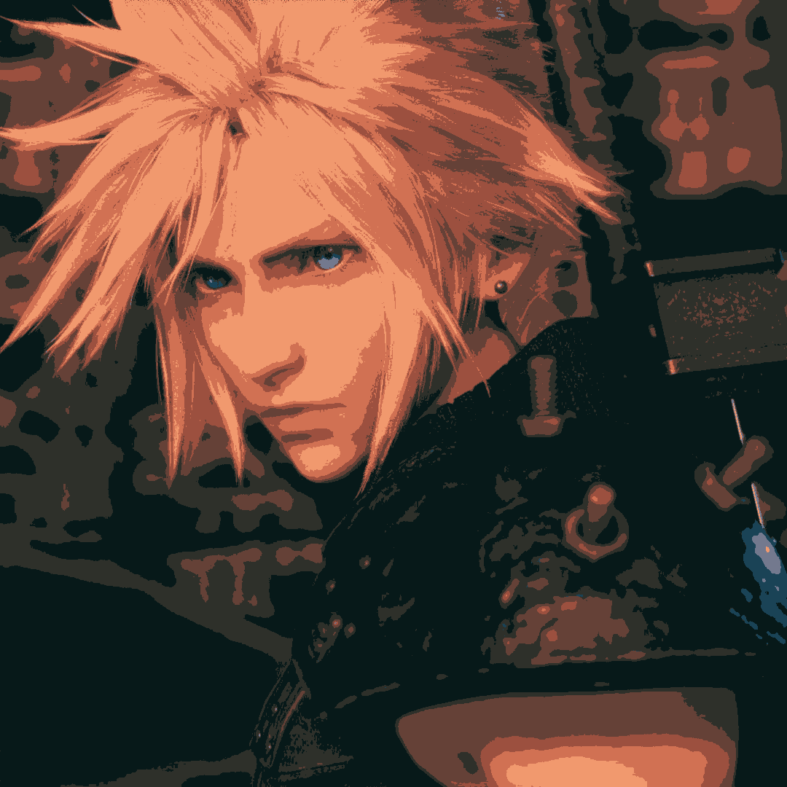

= Processamento Digital de Imagens (2024.2)
Carlos Antonio Miranda Filho <carlosantonio_miranda@hotmail.com>

== Cap 20 - Quantização Vetorial com k-means

0 k-means é um algoritmo comumente usado em aplicações voltadas para inteligência artificial, no qual ele faz um agrupamento de dados (conhecido como _clustering_), extrai informações de sua base e agrupa de acordo com alguma métrica. Além disso, ele é utilizado para reduções de dimensionalidade, logo ele também é aplicado para compressão de dados.

Dentro do processamento de imagens, para o seu algoritmo é oferecido valores em pontos flutuantes, então o dataset é dividido em _k_ classes para achar os centros. Estes centros, ao serem encontrados, serão os melhores conjuntos de elementos do algoritmo e a distância da amostra para o centro define a qual classe ela pertence.

Outra característica do k-means é o fato dele ser iterativo e simples. O usuário define quantas classes deseja e os seus centros, ao executá-lo define-se quantas vezes ele irá rodar ou as condições para a estabilização.

=== Exercícios 20.3

Para este exercício, o código k-means será rodado 10 vezes, porém a execução é feita mantendo o *_nRodadas_* = 1. A ideia é mostrar como o algoritmo atua no processamento de imagens e as diferenças de resultados captados. No começo do código, para explicitar que as diferenças ocorrem para cada rodada, foi introduzido uma linha nele que garanta isso, conforme mostrado a seguir:

[cpp]
----
    cv::theRNG().state = cv::getTickCount();
----

A linha acima altera a semente que gera números aleatórios para a imagem. O número de clusters utilizado aqui foi de 8.

O resultado dos diferentes resultados para cada rodada está expresso em forma de um gif, baseado na imagem que foi objeto de exemplo para o exercício do capítulo 19:

O código completo encontra-se abaixo:

[cpp]
----
#include <cstdlib>
#include <opencv2/opencv.hpp>

int main (int argc, char** argv) {
    int nClusters = 8, nRodadas = 1;

    cv::Mat rotulos, centros;

    if (argc != 3) {
        std::cout << "kmeans entrada.jpg saida.jpg\n";
        exit(0);
    }

    // Altere a semente do gerador de números aleatórios para garantir resultados diferentes em cada execução
    cv::theRNG().state = cv::getTickCount();

    //O k-means primeiramente opera sobre a imagem reduzindo as suas cores presentes
    cv::Mat img = cv::imread(argv[1], cv::IMREAD_COLOR);
    cv::Mat samples(img.rows*img.cols, 3, CV_32F); //aqui vou ter 3 colunas, cada uma pra uma cor R, G e B

    for (int y=0; y(y+x*img.rows, z) = img.at<cv::Vec3b>(y, x)[z]; //Vou copiar pixel a pixel
            }
        }
    }

    /*nClusters informa a quantidade de aglomerados que se deseja obter,  
    rotulos é um objeto do tipo Mat preenchido com elementos do tipo int, onde cada elemento
    identifica a classe à qual pertence a amostra na matriz samples*/

    cv::kmeans(samples, nClusters, rotulos, cv::TermCriteria(cv::TermCriteria::EPS |
        cv::TermCriteria::COUNT, 10000, 0.0001), nRodadas, cv::KMEANS_RANDOM_CENTERS, centros); 
        //O TermCriteria trata do criterio de parada: aqui é máx de até 10000 iterações ou tolerância de 0.0001

    cv::Mat rotulada(img.size(), img.type());
    for (int y=0; y(y + x*img.rows, 0);
            rotulada.at<cv::Vec3b>(y, x)[0] = (uchar)centros.at<float>(indice, 0);
            rotulada.at<cv::Vec3b>(y, x)[1] = (uchar)centros.at<float>(indice, 1);
            rotulada.at<cv::Vec3b>(y, x)[2] = (uchar)centros.at<float>(indice, 2);
        }
    }

    cv::imshow("kmeans", rotulada);
    cv::imwrite(argv[2], rotulada);
    cv::waitKey();
}
----