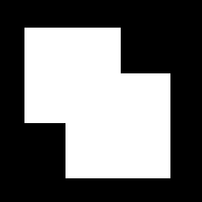

= Processamento Digital de Imagens (2024.2)
Carlos Antonio Miranda Filho <carlosantonio_miranda@hotmail.com>

== Cap 21 - Extração de Contornos

A forma de um objeto pode ser identificada através de técnicas de extrações de contornos. Existem formas de representação e descrição que se encarregam disso, como os descritores de Fourier, porém o OpenCV se dispõe de bibliotecas e comandos que já fazem esse trabalho como o ``**__cv::findContours__**``. Dentro deste comando, o usuário extrai o contorno das componentes conectadas através de ``**__cv::CHAIN_APPROX_NONE__**`` ou ``**__cv::CHAIN_APPROX_SIMPLE__**``. Ambas serão aplicadas em diferentes questões neste capítulo e foi constadada que existe diferença naquilo que o código obtém de pontos que compõem uma figura.

Além disso, um aspecto que o código faz é pegar as figuras e identificar seus contornos e deixar uma cor vermelha para marcá-las. Isto ocorre porque a imagem é convertida para um espaço de cores BGR.

=== Exercícios 21.2

A primeira parte do exercício trata da obtenção de pontos em uma imagem de dois retângulos que se encontram superpostos conforme mostrado abaixo:

O código para a aplicação dos exercícios encontra-se adiante:

[cpp]
----
#include <fstream>
#include <iostream>
#include <opencv2/opencv.hpp>

int main(int argc, char** argv) {
    cv::Mat image, gray;
    std::ofstream file;

    image = cv::imread(argv[1], cv::IMREAD_GRAYSCALE);

    if(!image.data) {
        std::cout << "Não abriu" << argv[1] << std::endl;
        return 0;
    }

    cv::threshold(image, image, 1, 255, cv::THRESH_BINARY + cv::THRESH_OTSU);

    std::vector<std::vector<cv::Point> > contours;
    std::vector<cv::Vec4i> hierarchy;

    cv::findContours(image, contours, hierarchy, cv::RETR_EXTERNAL,
                    cv::CHAIN_APPROX_NONE);
    
    cv::cvtColor(image, image, cv::COLOR_GRAY2BGR);

    //Fazendo a contagem dos pontos gerados
    int contagemPontos = 0;

    file.open("contornos.svg");
    if (!file.is_open()) {
        std::cout << "nao abriu contornos.svg" << std::endl;
    return 0;
    }

    file << "<svg height=\"" << image.rows << "\" width=\"" << image.cols
         << "\" xmlns=\"http://www.w3.org/2000/svg\"> " << std::endl;
    
    for(size_t i = 0; i < contours.size(); i++) {
        file << "<path d=\"M " << contours[i][0].x << " " << contours[i][0].y
         << " ";
    for (size_t j = 1; j < contours[i].size(); j++) {
        file << "L" << contours[i][j].x << " " << contours[i][j].y << " ";
        }
        file << "Z\" fill=\"#cccccc\" stroke=\"black\" stroke-width=\"1\" />"
         << std::endl;

        contagemPontos += contours[i].size();
        cv::drawContours(image, contours, i, CV_RGB(255, 0, 0));
    }
    file << "/svg" << std::endl;

    //Exibindo a contagem
    std::cout << "Total de pontos= " << contagemPontos << std::endl;

    cv::imshow("imagem", image);
    cv::waitKey();
    return 0;
}
----

Inicialmente a obtenção de pontos foi feito considerando o trecho ``**__cv::CHAIN_APPROX_NONE__**``. O resultado mostra uma obtenção de pontos muito maior do que aquilo que os nossos olhos poderiam imaginar, isto ocorre porque ele guarda todos os pontos conectados da figura. A consequência é que muitos pontos acabam se tornando redundantes e podem ocupar um volume demasiado grande na representação da figura, especialmente se ela for uma figura simples. Aqui o total de pontos acumulados foi igual a 746, conforme mostrado na execução abaixo:

Na etapa seguinte foi proposta uma pequena modificação no código acima, substituindo ``**__cv::CHAIN_APPROX_NONE__**`` por ``**__cv::CHAIN_APPROX_SIMPLE__**``. O resultado foi um valor de pontos capturados consideravelmente menor, de 746 pontos para 10 pontos. Muito embora nossos olhos observem 8 pontos por causa dos contornos dos retângulos, os 2 pontos restantes poderiam ser explicados pelo fato do código obter pontos que não estão visíveis ao olho humano, podendo ser subentendido que ele também pegue os contornos dos dois retângulos que por conta da cor branca das figuras sobrepostas não é possível ser visto. Em resumo, o novo comando elimina qualquer tipo de redundância no acúmulo de pontos. O resultado da execução encontra-se a seguir:

